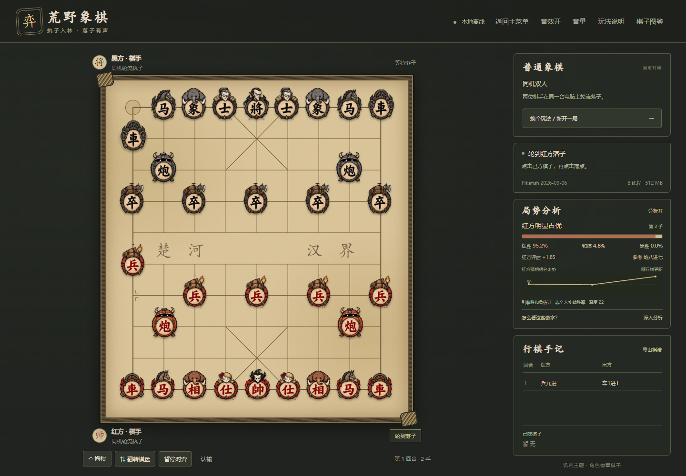
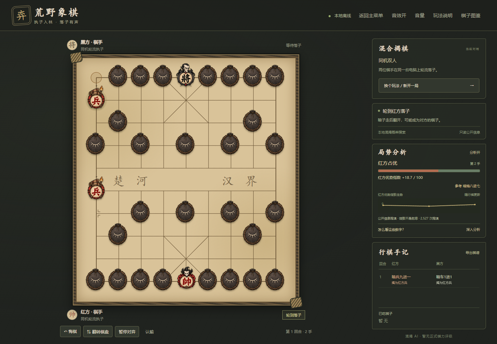

<p align="center">
  
</p>

<h1 align="center">荒野象棋 · Wilderness Xiangqi</h1>

<p align="center">把棋盘带进荒野。普通象棋与混合揭棋，两种玩法，完全本地对弈。</p>

<p align="center">
  <a href="https://github.com/Wu200008/wilderness-xiangqi/releases/latest">下载 Windows 版</a> ·
  <a href="docs/USAGE.md">使用指南</a> ·
  <a href="https://github.com/Wu200008/wilderness-xiangqi/issues">反馈问题</a> ·
  <a href="README.en.md">English</a>
</p>

饥荒风格的象棋桌面应用：手绘角色徽章、纸张与木纹棋盘、轻柔落子声。普通象棋使用 **Pikafish（皮卡鱼）**，混合揭棋使用专门的公开信息概率搜索 AI。所有对弈与分析计算都在你的电脑上完成，无需账号，也无需联网下棋。


## 下载后，三步开始

1. 打开 **[Releases 下载页](https://github.com/Wu200008/wilderness-xiangqi/releases/latest)**，下载 `wilderness-xiangqi-1.2.0-windows-x64.zip`。不要把 GitHub 自动生成的 `Source code` 当作游戏安装包。
2. **完整解压**到有写入权限的文件夹，双击里面的 **`荒野象棋.exe`**。不要只复制一个 exe，也不要在压缩包内直接启动。
3. 在主菜单选择玩法，再选择 **人机对弈 / AI 观战 / 同机双人**，设置执子方和难度，点击 **开始对局**。

发行包已包含 Electron、Pikafish 和匹配的 NNUE 权重；玩家不需要另装 Node.js、Python 或显卡计算环境。首次下载完成后，可断网使用。

**运行环境：**Windows 10 / 11，64 位 x64 CPU。建议 8 GB 及以上内存、预留 2 GB 磁盘空间；窗口最小为 1100 × 800，建议提供足够的屏幕可用空间。当前不提供 macOS、Linux、Windows ARM 或手机版安装包。

## 有什么可以玩

| 玩法 | 人机对弈 | AI 观战 | 同机双人 | 局势分析 |
| :-- | :--: | :--: | :--: | :-- |
| 普通象棋 | ✓ | ✓ | ✓ | 红胜 / 和棋 / 黑胜估计、评估分、参考走法、走势 |
| 混合揭棋 | ✓ | ✓ | ✓ | 基于公开信息的优势指数、参考走法、走势 |

- **从主菜单开始：**先选玩法再开局；返回菜单会暂停并保留当前棋局，可以继续。
- **按自己的节奏下：**入门、进阶、困难、全力及自选思考时间；AI 观战支持暂停、继续和单步。
- **方便练习：**合法落点提示、悔棋、翻转棋盘、认输、公开 JSON 棋谱导出。
- **听得舒服：**柔和的单次落子声，音量调节、试听与静音记忆；没有菜单连响或背景音乐。
- **看清局势：**自动分析与约 3 秒的深入分析，可关闭分析来减少 CPU 使用。



<details>
<summary>查看混合揭棋与开局设置</summary>




</details>

## 混合揭棋是什么

这是本项目采用的**跨颜色混洗变体**，不等同于通常双方各洗自己棋子的揭棋，也不是半盘翻翻棋：

- 将帅留在原位并公开，其余 **30 枚红黑棋子共同混洗**。
- 暗子由开局位置所属的一方控制；第一步按原位置的棋种走，落子后翻开。
- 翻开后按真实棋种和颜色行棋，**有可能变成对方的棋子**。
- 吃掉对方控制的暗子时，不论真实颜色都移除，并公开身份。
- 士翻明后可出九宫，象可过河但仍受象眼限制；将帅仍受九宫限制。
- 随机翻出敌子而使己将受攻击，这步仍成立，对方下一回合可以吃将。

揭棋 AI 只接收公开局面与剩余身份数量，**不读取底牌**。完整判定见 [使用指南](docs/USAGE.md#混合揭棋的完整约定)。

## AI 与“胜率”怎么看

**普通象棋：**使用官方 Pikafish **2026-09-06** 与匹配 NNUE。难度改变搜索预算，界面不会改变引擎的标准棋规。胜 / 和 / 负来自引擎自己的统计模型，是当前局面的估计，不是个人胜率或必胜承诺；走势显示红方预期得分 `红胜 + 和棋 ÷ 2`。

**混合揭棋：**使用本项目的概率树搜索，不是普通 Pikafish 直接套用暗子规则。AI 与分析均只使用公开信息；显示的是 **−100 到 +100 的优势指数**，尚未校准成胜率，也没有正式棋力评级。

这是一款本地陪练与娱乐应用。棋盘使用简化的重复局面和无进展判和约定，**未实现完整比赛长将、长捉责任裁定**。当前仅支持同机双人；关闭整个程序不会保存当前棋局，JSON 导出也不是可恢复的存档。

## 从源码运行

开发环境：**Windows x64、Node.js 22.12.0 或更新的受支持版本、npm、Git**。以下命令在 PowerShell 中执行：

```powershell
git clone https://github.com/Wu200008/wilderness-xiangqi.git
cd wilderness-xiangqi
npm ci
npm run fetch:engine
npm start
```

依赖安装和首次获取引擎需要联网，之后运行无需联网。`fetch:engine` 下载固定版本的官方引擎与匹配模型，并核验下载内容；引擎和模型不会作为大文件提交到 Git。

默认引擎位置为 `engines/pikafish/pikafish.exe`，权重 `pikafish.nnue` 放在同一目录。需要指定另一个兼容引擎时，可以设置绝对路径：

```powershell
$env:WILD_CHESS_ENGINE_PATH = 'D:\engines\pikafish\pikafish.exe'
npm start
```

请使用与该引擎匹配的权重；自定义版本的输出和棋力不属于本发行版的验证范围。不要直接用浏览器打开 `app/index.html`，普通象棋需要 Electron 的本地引擎桥接。

### 测试与打包

```powershell
npm test
npm run test:engine
npm run build:portable
npm run test:portable
```

`npm test` 检查规则、混揭 AI 与分析逻辑；`test:engine` 需要已下载的真实引擎。便携包构建还需要 PATH 中的 **MinGW-w64 `gcc` 与 `windres`**，用来生成带主题图标的 Windows 启动器。便携包检查会启动独立的隐藏测试窗口。

```text
app/                 界面、音效、规则、AI 与本地引擎桥接
app/assets/          棋子、图标与生成记录
docs/                使用说明、截图、版本说明和第三方许可
engines/             本地下载的引擎及权重（不提交）
scripts/             引擎获取、打包及验证脚本
```

## 许可与致谢

本项目自行编写的程序源码以 **[GPL-3.0-only](LICENSE)** 提供。发行包中的组件保留各自许可，不能把整个包视为统一许可的素材库：

- **Pikafish：**感谢 [official-pikafish](https://github.com/official-pikafish/Pikafish)。引擎遵循 GPLv3；发行页同时提供对应版本源码，详见 [第三方说明](THIRD_PARTY_NOTICES.md)。
- **NNUE 权重：**遵循单独的 [Pikafish NNUE 许可](docs/Pikafish-NNUE-License.md)，未经许可不得商用；不受本项目 GPL 声明重新授权。上游说明见 [官方 Networks 仓库](https://github.com/official-pikafish/Networks)。
- **桌面运行环境：**感谢 [Electron](https://www.electronjs.org/)，其及所含组件的许可随发行包保留。
- **美术：**饥荒风格的 AI 生成粉丝设计，生成记录在 [`app/assets/generation.txt`](app/assets/generation.txt)。本项目非 Klei 官方作品，未使用官方背书；角色、名称与相关权利属于各自权利人。本项目源码许可不授予这些角色或图像的独立商用权。

发现问题或有改进想法，欢迎通过 [Issues](https://github.com/Wu200008/wilderness-xiangqi/issues) 反馈。请附上版本、玩法、复现步骤，必要时附公开棋谱；完整操作说明见 [使用指南](docs/USAGE.md)，版本变化见 [CHANGELOG](CHANGELOG.md)。
