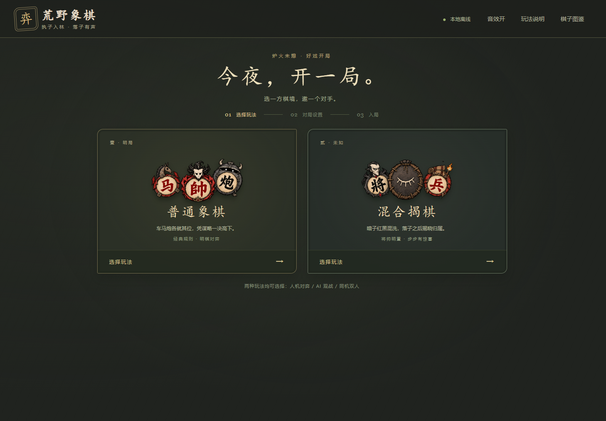
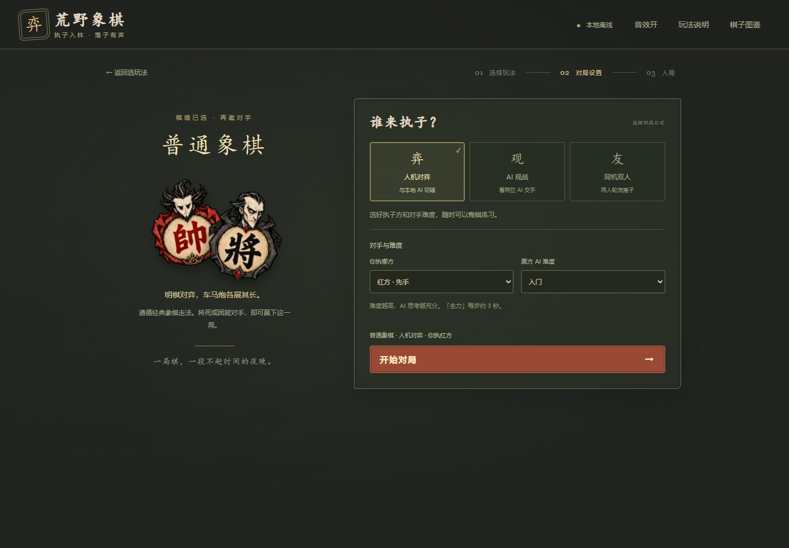
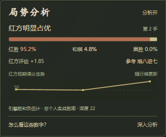
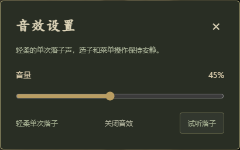

# 荒野象棋使用指南

[返回首页](../README.md) · [下载发行版](https://github.com/Wu200008/wilderness-xiangqi/releases/latest)

## 第一次打开

下载 Windows x64 便携包，完整解压到可以写入的文件夹，然后运行 `荒野象棋.exe`。保留同目录中的运行环境、引擎和模型文件，不要单独移动 exe。

音量、静音及分析开关等偏好保存在 `app/userdata/`。移动整个解压文件夹时可一并保留；它不包含可恢复的对局存档。

1. 在主菜单选择 **普通象棋** 或 **混合揭棋**。
2. 选择 **人机对弈**、**AI 观战** 或 **同机双人**。
3. 人机模式选择自己执红或执黑；有 AI 的位置可设置难度和思考时间。
4. 点击 **开始对局**，进入棋盘。红方先行。

## 六种对战组合

| 玩法 | 对战方式 | 适合做什么 |
| :-- | :-- | :-- |
| 普通象棋 | 人机对弈 | 与本地 Pikafish 下标准象棋 |
| 普通象棋 | AI 观战 | 让两方 AI 自动下棋，可分别设置难度 |
| 普通象棋 | 同机双人 | 两人在同一台电脑轮流下标准象棋 |
| 混合揭棋 | 人机对弈 | 与不读取暗子底牌的本地概率 AI 对弈 |
| 混合揭棋 | AI 观战 | 观察概率 AI 对未知身份的选择 |
| 混合揭棋 | 同机双人 | 两人共享一个屏幕，落子后共同揭晓棋子 |

同机双人不需要账号或网络。目前没有局域网或互联网联机功能。

## 下棋、暂停与悔棋

- **落子：**点击己方可以控制的棋子，再点击标出的合法落点。棋种和阵营以汉字及红黑颜色为准。
- **翻转棋盘：**只改变观看方向，不交换执子方。
- **AI 观战：**可暂停、继续，或在暂停时单步执行一手。
- **悔棋：**人机模式退回到人的回合；同机双人退一手；AI 观战退一手并暂停。
- **认输：**确认后结束当前对局。
- **返回主菜单：**暂停 AI，保留本次运行中的棋局；点“继续对局”可回来。
- **新开一局：**已经走子时会先确认。设置页的更改仅在开始新局后生效，不会修改保留棋局的设置。

原本已经暂停的棋局，返回后仍保持暂停。**关闭程序会丢失当前棋局**；如需保存对局记录，请先导出棋谱。当前没有存档恢复或棋谱导入功能。

## 选择难度

| 难度 | 普通象棋搜索预算 | 混合揭棋推演时间 |
| :-- | :-- | :-- |
| 入门 | 1,000 节点 | 约 0.15 秒 / 手 |
| 进阶 | 10,000 节点 | 约 0.6 秒 / 手 |
| 困难 | 100,000 节点 | 约 1.8 秒 / 手 |
| 全力 | 约 3 秒 / 手 | 约 3 秒 / 手 |
| 自选用时 | 1 / 3 / 5 / 10 / 15 / 30 秒 | 1 / 3 / 5 / 10 / 15 / 30 秒 |

难度是计算预算，不代表经过测试的人类 Elo 段位。节点模式的耗时取决于 CPU 与局面；即使选“入门”，普通象棋 AI 也可能很强。混揭 AI 未经正式棋力评级，增加时间通常提供更多推演机会，不保证每一步都更好。

普通对弈默认使用 8 个 CPU 线程、512 MB Hash。自动分析另开引擎，使用 2 个线程、128 MB Hash。显卡不是运行要求，选择较长思考时间或同时开启分析会提高 CPU 使用率。

## 局势分析

分析栏默认开启。点击“分析开”可关闭，开关会保存；返回主菜单会停止额外分析。

### 普通象棋：胜、和、负分别显示

“红胜 / 和棋 / 黑胜”来自 Pikafish 自带的统计模型，三项合计 100%。例如红胜 35%、和棋 50%、黑胜 15%，表示引擎对当前局面的估计，**不是玩家已经赢下这局的概率保证**。和棋单独列出，所以红胜与黑胜未必合计 100%。

评估分固定从红方看：正数利红，负数利黑；`M` 表示搜索发现杀棋。走势画的是 **红方预期得分 = 红胜 + 和棋 ÷ 2**。上例为 60；50 表示预期得分相当，不等于“红胜 50%”。

如果引擎没有返回完整概率数据，界面只显示可用的评估分，不自行把分数包装成胜率。

### 混合揭棋：优势指数

混揭 AI 从公开棋子与共同的剩余身份池进行推演，不读取暗子的实际排列。优势指数范围为 **−100 到 +100**：正数偏红，负数偏黑，0 附近相当。

这个指数未经过胜率校准，**不是百分比**。未知身份与后续翻子会造成较大变化，应结合局面理解。

### 深入分析与更新时机

自动分析默认每次约 1 秒，与对弈独立运行。AI 快速观战时，评估可能对应稍早的局面；请看标注的手数，曲线只连接已经分析的点。

点击“暂停并深入”会先暂停对局，再分析当前局面约 3 秒；结束后通过“继续对弈”恢复。已经暂停或同机双人时，按钮显示“深入分析”。参考走法只作提示，不会自动帮玩家落子。

悔棋会删除回退位置之后的走势，新局会清空旧走势。终局显示实际结果。

## 普通象棋规则与本地判和

棋子的标准走法、马腿、象眼、九宫、过河兵与将帅照面等由本地规则层判断。不能主动把己方将帅留在受攻位置；将死或困毙判负。

本项目采用以下本地和棋约定，任何一条达到即可判和：

| 条件 | 本项目判定 |
| :-- | :-- |
| 重复 | 同一公开局面出现三次 |
| 无进展 | 连续 120 半回合没有吃子；揭棋翻子也会重置此计数 |
| 长度上限 | 400 半回合 |

**半回合指任意一方走一手**，红黑各走一次是两个半回合。此版不包含完整比赛长将、长捉责任裁定，因此某些循环局面会比正式赛事更早按和棋处理。

## 混合揭棋的完整约定

这是本项目的跨颜色变体。与常见“各方只洗自己的 15 枚暗子”规则不同，开始时两方颜色在共同池中混洗。

1. **布置：**将、帅按普通象棋位置摆放且始终公开。其余 30 枚棋子红黑混洗，盖住后放回其余开局位置，所有背面一致。
2. **暗子归属：**未揭开时，以开局所在的红方或黑方阵地确定暂时控制方。
3. **第一步：**按该开局位置原本的棋种走。例如炮位暗子第一步按炮走；兵位暗子第一步按兵走。
4. **走后揭示：**落子后公开真实棋种与颜色；如果是对方颜色，该棋子立即归对方控制，以后的走法按真实身份确定。
5. **吃暗子：**可以吃对方暂时控制的暗子。无论它实际是红是黑，都被移除，真实身份公开记入棋谱。
6. **明子走法：**士可在全盘斜走一步；象可过河、仍走田字且受象眼限制；将帅仍在九宫内行走。其他明子按对应普通棋种的走法行动。
7. **将军判定：**走棋前按公开占位身份检查是否自将，不借用底牌判断合法性。
8. **随机造成自将：**如果合法落子后翻出敌子，导致自己的将帅受攻击，这一步仍有效；对方下一回合可以吃将并立即获胜。
9. **终局：**吃将获胜、无合法走法判负；主动认输及上述本地判和约定同样适用。

例如，红方移动红炮位置的一枚暗子，落子后翻出黑车：这一手是合法的炮式移动，从此那枚棋子归黑方，并按车走。它不会因为原来由红方控制而保留红方归属。

混揭 AI 先选动作，再从**红黑共同的剩余身份池**模拟揭示。同一步既吃暗子又揭子时，抽样不放回，避免把同一个身份重复分配。真实底牌不发送给 AI 或分析工作线程。

悔棋会回退棋面与底牌排列，但双方已经看过的身份无法从人的记忆里撤销。双人对弈时可自行约定是否允许悔棋。

## 音效

右上角开关控制静音；“音量”打开滑条与“试听落子”，默认音量为 45%。开关与音量分别保存，音量为 0 或静音时停止声音。

落子是一声柔和的短响，吃子稍沉；揭子、将军、开局和胜负也有简短提示。选子、菜单点击和无效落点保持安静，没有背景音乐。所有声音在本机合成，不需要下载音频。

## 导出棋谱

在“行棋手记”中点击“导出棋谱”，保存 JSON 文件。内容包括公开局面、走子、已揭身份、吃子与结果，**不包含尚未揭开的底牌、随机种子或秘密排列**。

导出适合留作记录或在 Issue 中附上复现信息，不是可恢复的完整存档；当前界面没有导入按钮。

## 常见问题

### 需要网络、账号、付费接口或 GPU 吗？

不需要。发行包下载完毕后，对弈、分析、图像和声音都可离线运行。计算使用本机 CPU。源码开发时，安装 npm 依赖与首次获取引擎需要网络。

### 打不开或提示缺少引擎 / 模型怎么办？

确认完整解压了发行包，而不是只拿出 exe。源码运行请先执行 `npm ci` 和 `npm run fetch:engine`。指定自定义引擎时，检查 `WILD_CHESS_ENGINE_PATH` 是正确的绝对路径，匹配的 `pikafish.nnue` 在引擎同目录。

### Windows 提示无法识别发布者怎么办？

当前便携包没有商业代码签名。请先确认文件来自本仓库 Releases，并按该页说明校验 SHA-256。只在确认来源后决定是否运行；不需要关闭系统防护。

### 风扇较响或 CPU 占用高怎么办？

搜索与分析确实在本地计算。可降低 AI 难度或思考时间，关闭局势分析；观战时点击暂停，或返回主菜单。

### 为什么胜率会变化？为什么揭棋没有百分比？

分析取决于局面、搜索时间与引擎统计模型，走错一步或增加搜索深度都可能改变判断。混揭优势指数没有经过真实胜负数据校准，直接写成百分比会误导，因此保持指数显示。

### 能保证胜过任何人、或者 100% 胜率吗？

不能。普通模式使用较强的开源引擎，但结果仍受规则、计算预算和对手影响；混揭 AI 更没有正式评级，不把它描述为比赛冠军模型。

### 可以联网对战、载入残局或恢复上次游戏吗？

本版没有这些功能。同机双人指共用一台电脑；菜单中的“继续对局”仅保留本次运行内的棋局，关闭后不会恢复。

### 我能把整个发行包用于商业项目吗？

程序源码、Pikafish 引擎、NNUE 权重和粉丝图像不是同一许可范围。特别是模型权重要求商业使用另获许可，图像也不代表拥有角色权利。请查看 [第三方说明](../THIRD_PARTY_NOTICES.md) 和各自许可。

### 怎样反馈问题？

在 [Issues](https://github.com/Wu200008/wilderness-xiangqi/issues) 选择问题模板，说明版本、Windows 版本、玩法与对战方式、复现步骤。若与某步棋有关，附上导出的公开棋谱和截图即可；发布前检查附件中没有个人信息。
